toybrick()
----------

[OpenSCAD](http://openscad.org) program to generate toy bricks compatible with many popular toy brick systems that I cannot name here.

The resulting models can be made real through 3D printers or CNC machines.

This is an example of how to use OpenSCAD to program 3D models and thinking in terms of constructive solid geometry. Follow along...

### Intro to OpenSCAD

Before you begin, learn the 4 important concepts in my quick deck:

#### [Programming 3D Objects with OpenSCAD](https://speakerdeck.com/joewalnes/programming-3d-object)

Ok, done that? Onwards.

### What is this?

This is a very simple 3D library that has one function:

```scad
toybrick(length, width);
```

It outputs a 3D model.

### Examples

> Pssst! Did you know GitHub has an **[interactive 3D viewer](examples/toybrick-4x2.stl)**? Mind. Blown.

| Code                                                      | Top                                               | Bottom                                               |
|:---------------------------------------------------------:|:-------------------------------------------------:|:----------------------------------------------------:|
| `toybrick(1,1)`  [3D viewer](examples/toybrick-1x1.stl)   | 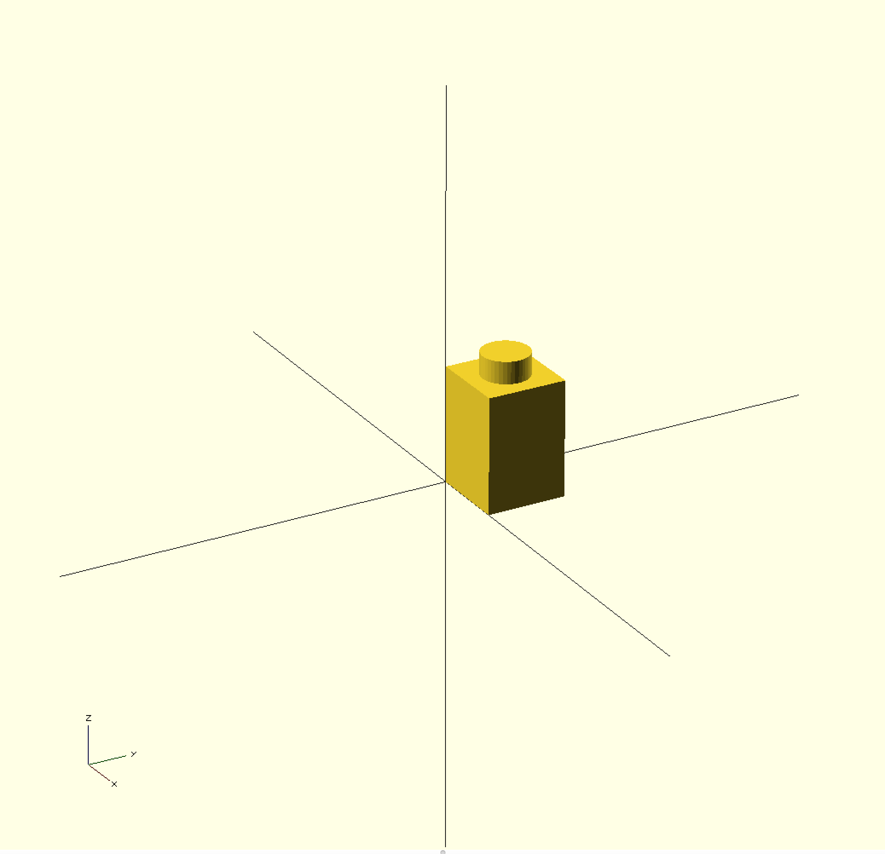   | 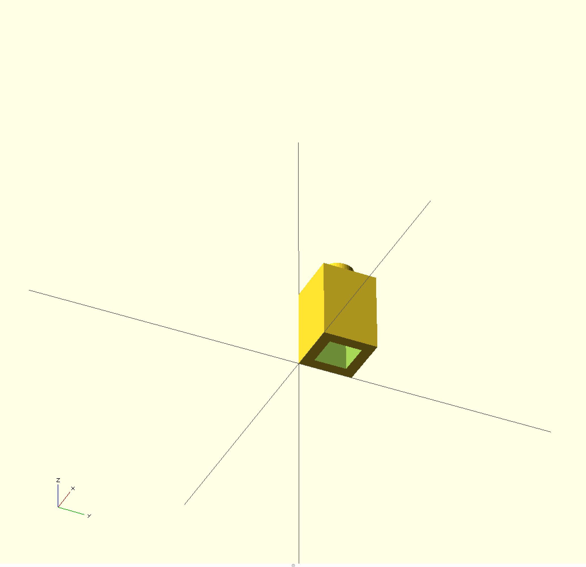   |
| `toybrick(4,2)`  [3D viewer](examples/toybrick-4x2.stl)   | 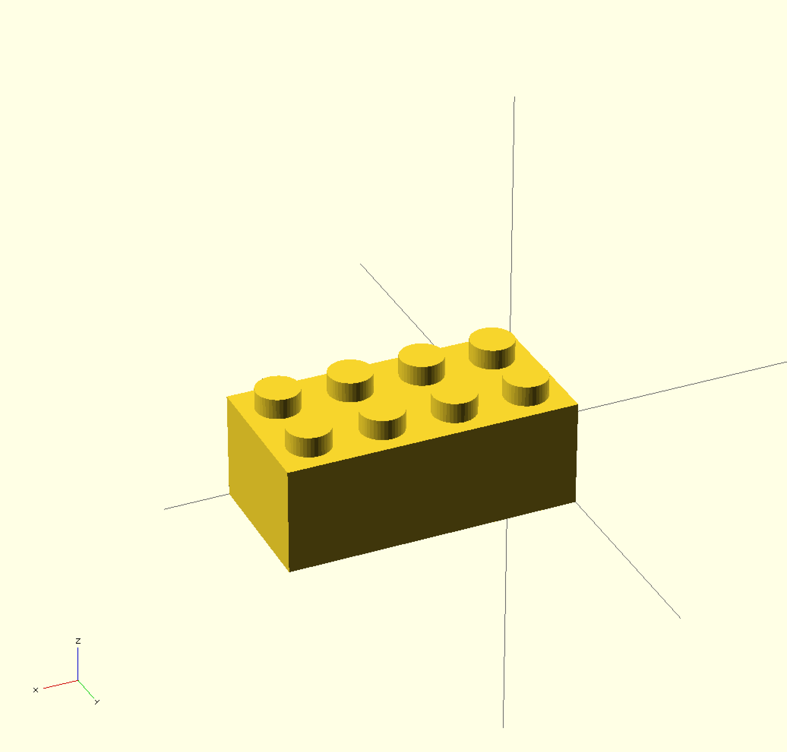   | 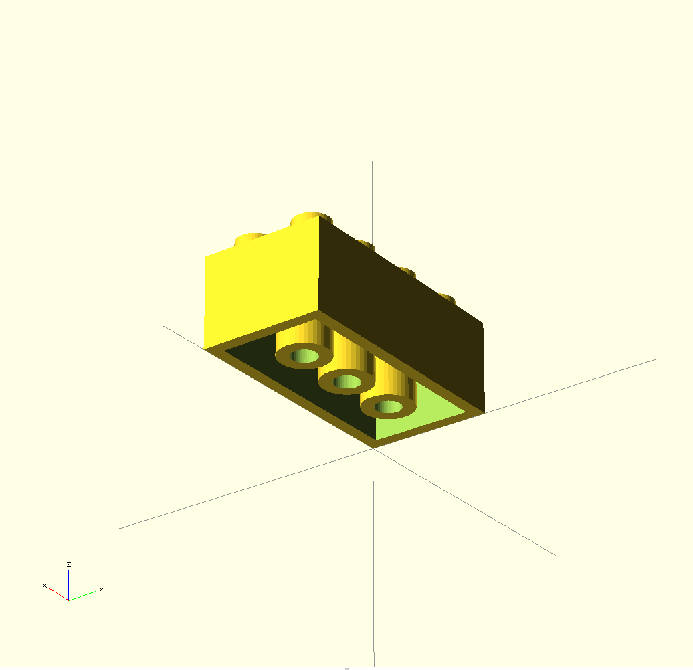   |
| `toybrick(5,3)`  [3D viewer](examples/toybrick-5x3.stl)   | 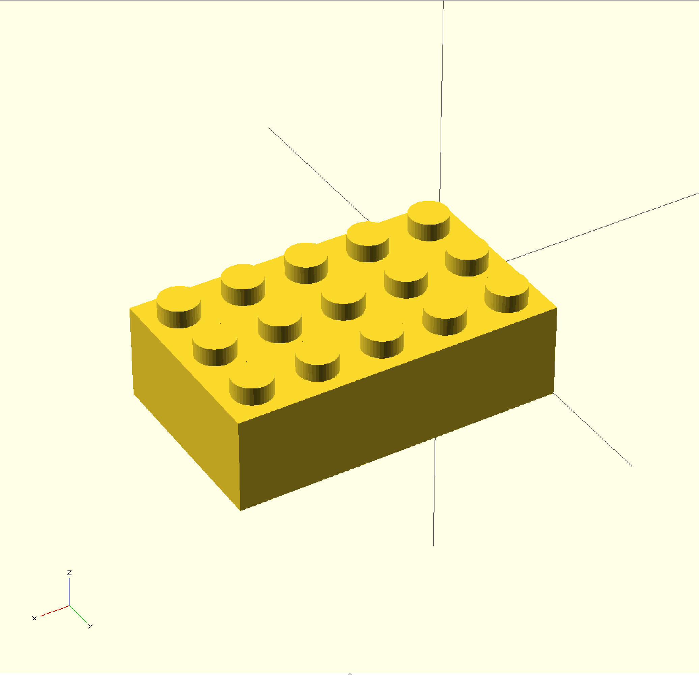   | 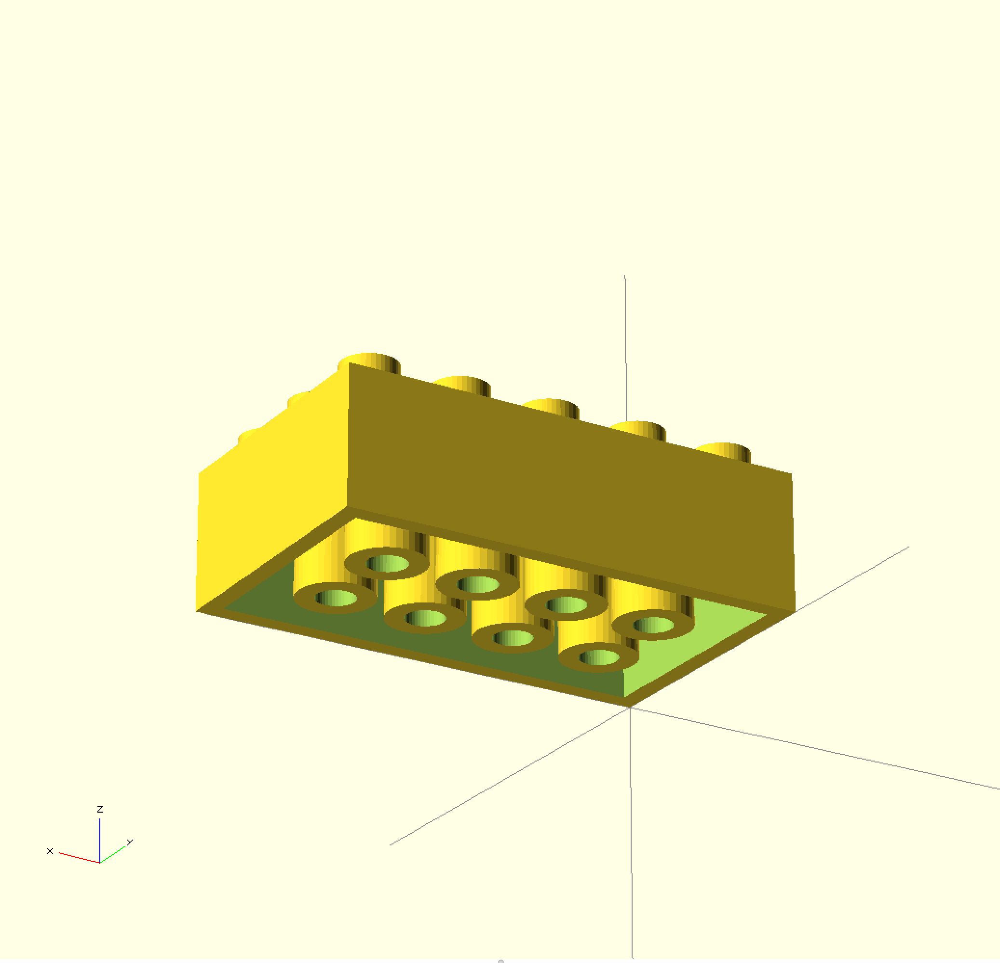   |
| `toybrick(6,6)`  [3D viewer](examples/toybrick-6x6.stl)   | 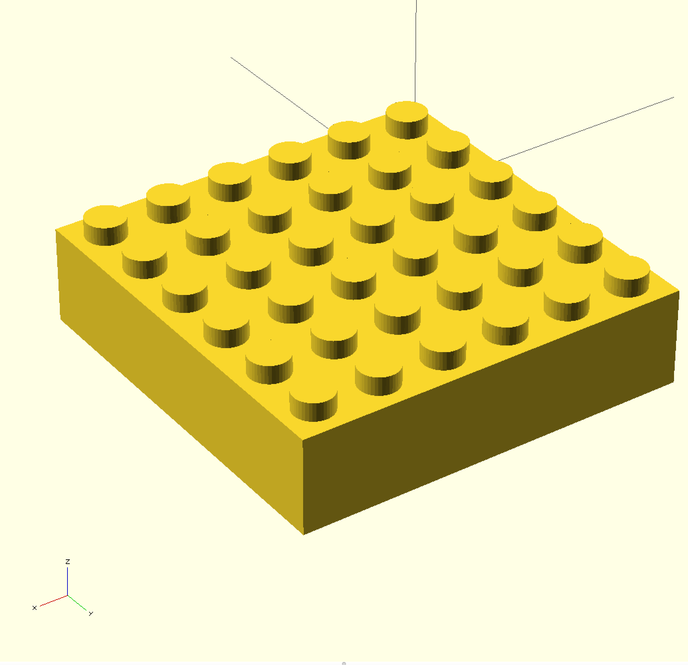   | 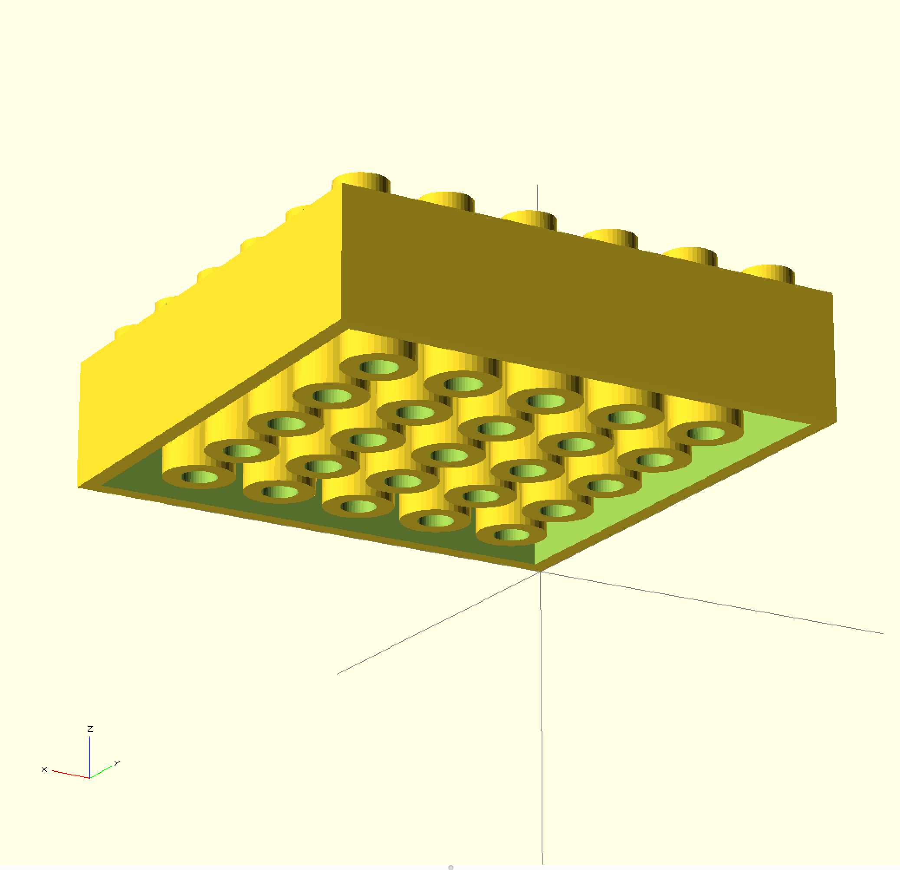   |
| `toybrick(10,2)` [3D viewer](examples/toybrick-10x2.stl)  | 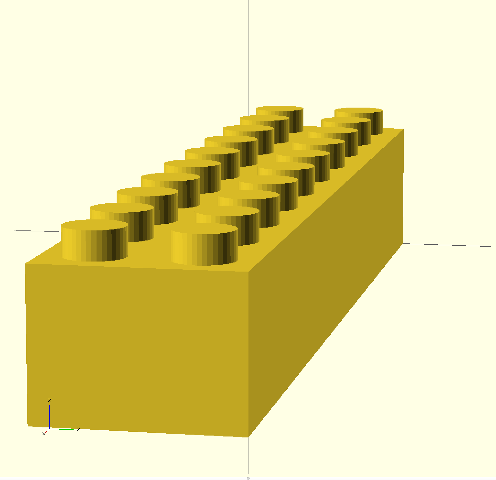 | 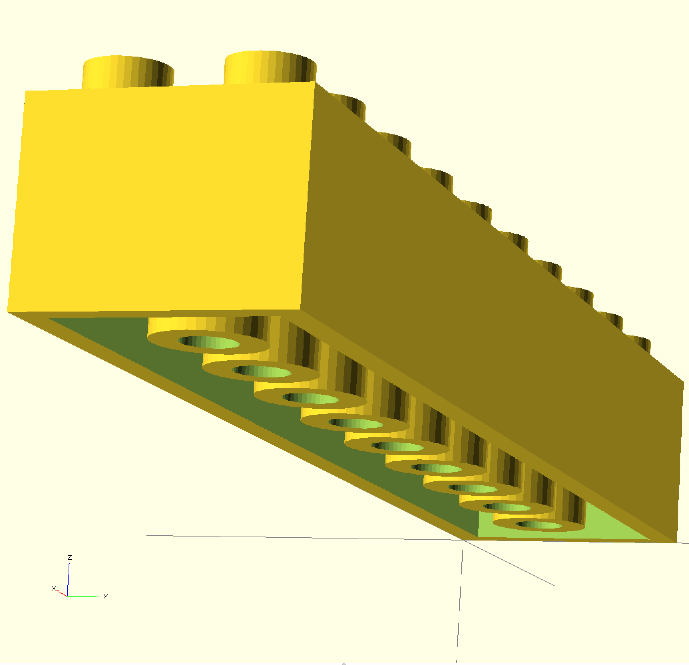 |

### Implementation

Woah there. If you skipped the [Programming 3D Objects with OpenSCAD](https://speakerdeck.com/joewalnes/programming-3d-object) deck, go back. It's really short. You need to understand the 4 fundamental concepts first.

##### High level

A toy brick consists of:
* a **body** (main hollow brick)
* `n × m` **top studs**
* `(n-1) × (m-1)` **inner tubes**

That's it.

> Note: The variables used for dimensions are defined in [toybrick-dimensions.scad](toybrick-dimensions.scad)

##### Body

Well this is easy. Take a block (scad `cube()`), then hollow it out by calling `difference()` on another block:

```scad
module body(units_wide, units_long) {
	difference() {
		cube([
				units_wide * length,
				units_long * length,
				height]);
		translate([wall_thickness, wall_thickness, 0]) {
			cube([
					units_wide * length - wall_thickness * 2,
					units_long * length - wall_thickness * 2,
					height - wall_thickness]);
		}
	}
}
```

##### Stud

Even easier, it's just a `cylinder()` translated to the right place on top of a block:

```scad
module stud(unit_x, unit_y) {
	translate([
			(unit_x + 0.5) * length,
			(unit_y + 0.5) * length,
			height]) {
		cylinder(d=stud_diameter, h=stud_height);
	}
}
```

##### Inner tube

Another `cylinder()`, hollowed out using the `difference()` of an inner `cylinder()`:

```scad
module tube(unit_x, unit_y) {
	translate([
			unit_x * length,
			unit_y * length,
			0]) {
		difference() {
			cylinder(d=tube_diameter, h=height - wall_thickness);
			cylinder(d=tube_diameter - wall_thickness * 2, h=height - wall_thickness);
		}
	}
}
```

##### Bringing it all together

Now we call our smaller modules to create the `body()`, and a `for` loop to add the `stud()s` and `tube()s`:

```scad
module toybrick(units_wide, units_long) {

	// Step 1: Make the body (main hollow brick)
	body(units_wide, units_long);

	// Step 2: Now loop over x,y...
	for (x=[0 : units_wide - 1], y=[0 : units_long - 1]) {

		// Top stud
		stud(x, y);

		// If beyond the first column and row, inner tube
		if (x > 0 && y > 0) {
			tube(x, y);
		}

	}

	// That's it!
}
```

#### The final code:

* [toybrick.scad](toybrick.scad)
* [toybrick-dimensions.scad](toybrick-dimensions.scad)
* [example1.scad](example1.scad) (standalone example)

### Building on it

Now we have a basic `toybrick()` we can make programs that use it to make other things.

Like a **pyramid**:

```scad
layers = 6;

for (i = [ 1 : layers ]) {
  translate([length * i * -1,
             length * i * -1,
             height * (i * -1 + layers)]) {
    toybrick(i * 2, i * 2);
  }
}
```
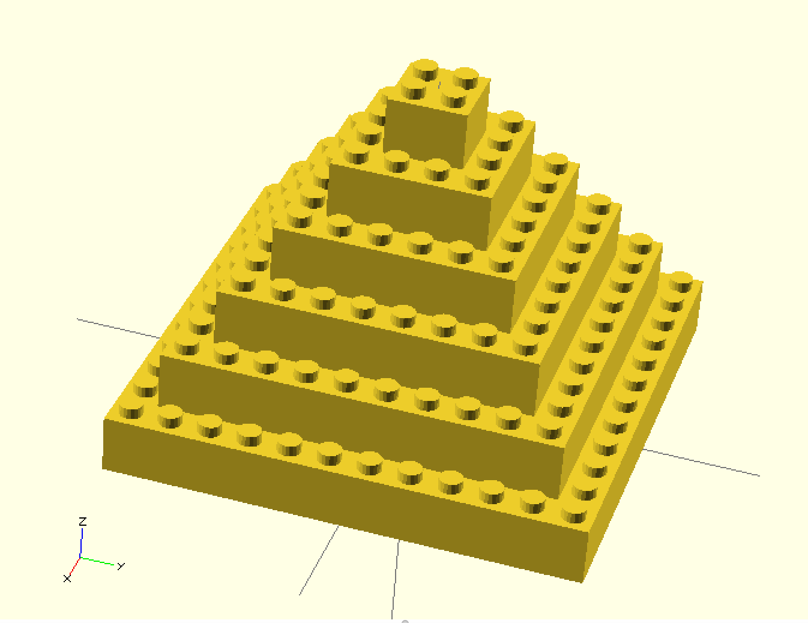

[3D viewer](examples/pyramid.stl)

### What next?

Go read the [OpenSCAD manual](https://en.wikibooks.org/wiki/OpenSCAD_User_Manual), look for inspiration on [Thingiverse](http://www.thingiverse.com/search?q=openscad) and [follow me on Twitter](https://twitter.com/joewalnes).

**ABC: Always Be Creating**
